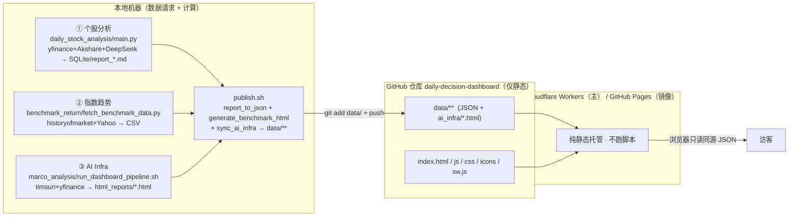

# 数据生产与发布链路（个股分析 / 指数趋势 / AI Infra）

> 「决策仪表盘」三个 Tab 的端到端链路：**数据请求 + 计算全在本地**，每天本地刷一次，
> 把 `data/**` 推送到 GitHub；**GitHub/Cloudflare 只做前端渲染**（静态托管，不执行任何脚本）。
> 访客浏览器零外部 API（CSP `connect-src 'self'` 硬约束）。
>
> 一键入口：[`scripts/daily_refresh.sh`](scripts/daily_refresh.sh)。

---

## 0. 核心架构：本地算、GitHub 只渲染



**三条铁律**

1. **数据请求 + 计算 = 100% 本地**。三条 Python 流水线只在本机跑。
2. **GitHub 仓库 = 前端渲染 + 静态数据**。Pages workflow（`.github/workflows/pages.yml`）
   只把整目录 `upload-pages-artifact`，**没有任何构建/Python 步骤**；仓库里的 `.py/.sh`
   都是「随源码留档」的惰性文件，边缘端永不执行。
3. **每天的增量 = 基本只有 `data/**`**。前端代码（index.html/js/css）仅在改 UI 时才推。

---

## 1. 三个数据源与「数据请求」清单

| # | Tab | 流水线入口 | 数据请求（外部 API） | 本地产物 | 喂给前端的静态文件 |
|---|-----|-----------|----------------------|----------|--------------------|
| ① | 个股分析 | `daily_stock_analysis/main.py` | yfinance / Akshare（OHLCV）、新闻、DeepSeek（LLM）、雪球（市值/Forward PE） | SQLite K 线、`reports/report_*.md`、`trade_action_*.md`、`watchlist_fundamentals_*.csv` | `data/reports/<date>/index.json` + `charts/*.json` + `manifest.json` |
| ② | 指数趋势 | `benchmark_return/fetch_benchmark_data.py` | historyofmarket.com（sp500/nasdaq/XLK/XLF）、Yahoo chart（SMH） | `market_prices_post2020_publish.csv`（gitignore） | `data/benchmark_indices.json`（含 sinceBase / ytd / drawdownCompare） |
| ③ | AI Infra | `marco_analysis/run_dashboard_pipeline.sh` | timsun.net（市值/PE/历史）、yfinance（备份）、Yahoo/yfinance（QQQ） | `marco_analysis/html_reports/dashboard_*.html`（5 个） | `data/ai_infra/dashboard_*.html`（5 个，由 `sync_ai_infra.sh` 拷入） |

---

## 2. 串联顺序（publish.sh 内部）

`daily_refresh.sh` 先跑 ③，再把 ①②同步与落地都交给 `publish.sh`：

```
daily_refresh.sh
└─ ③ marco run_dashboard_pipeline.sh      (产出 AI Infra html_reports)
└─ publish.sh
   ├─ ① main.py                            (行情/新闻/LLM → report_*.md)
   ├─ ① rebuild_benchmark_from_db.py       (用最新 SQLite 重算 QQQ 基准)
   ├─ ① generate_trade_action_report.py    (规则 + DeepSeek)
   ├─ ① fetch_watchlist_fundamentals       (雪球市值/PE)
   ├─ ② fetch_benchmark_data + generate_benchmark_html   → data/benchmark_indices.json
   ├─ ③ sync_ai_infra.sh                    (marco html_reports → data/ai_infra)
   ├─ report_to_json.py                     → data/reports/** + manifest.json
   └─ git add data/ (+ --push)              → GitHub → 边缘端重建
```

---

## 3. 去重：三源数据请求的重叠与处理

- **指数趋势（②）完全独立**：抓的是 sp500 / nasdaq / SMH / XLK / XLF（指数与板块 ETF），
  与个股、AI Infra **无任何标的重叠**。
- **真实重叠在 ① 与 ③**：
  - **QQQ**：个股链路（main.py 预取 + `rebuild_benchmark_from_db` 从 SQLite 重算）与
    AI Infra（`update_qqq_benchmark.py`）各抓一次。
  - **约 16 个半导体/算力标的**（TSM、NVDA、AMD、AAPL、INTC、MU、SNDK、LITE、NOK、
    GOOG(L)、AMZN、MSFT、META、ORCL、TSLA、CRWV）在两源各抓一次。
- **为什么不强行合并**：两源**用途与存储都不同**——①要逐日 OHLCV（喂 K 线/打分，落 SQLite）；
  ③要市值 / Forward PE / 收益率指标（来自 timsun.net，落 marco 自己的 data）。字节级共享需引入
  共享行情缓存层，属较大重构。
- **当前可落地的「去重」**：
  1. **每天每源各跑一次**——由 `daily_refresh.sh` 统一编排，杜绝人工重复触发 / 重复 publish。
  2. **各源内部已增量**——`update_qqq_benchmark.py` 只补 SQLite 缺失日期；个股侧亦按日增量。
  3. 顺序固定（③ → ①② → 同步 → 落地 → push），便于一次跑通、问题可定位。
- **未来优化（可选）**：抽出统一 price-cache（一次抓取，多处复用），可消除 QQQ + 这 16 个标的的重复请求。

---

## 4. GitHub 仓库里有什么 / 没有什么

仓库 `daily-decision-dashboard` 根即 `webapp/`（`daily_stock_analysis`、`marco_analysis` 是**仓库外**的本地兄弟目录）。

| 类别 | 路径 | 是否进仓库 | 边缘端是否执行 | 何时变更/推送 |
|------|------|-----------|----------------|----------------|
| **前端渲染** | `index.html`、`js/`、`css/`、`icons/`、`sw.js`、`manifest.webmanifest`、`_headers` | ✅ 是 | 仅作为静态资源被读取 | 改 UI 时 |
| **每日数据** | `data/**`（`reports/`、`benchmark_indices.json`、`ai_infra/*.html`、`manifest.json`） | ✅ 是 | 否（仅被前端 fetch） | **每天**（核心增量） |
| **本地工具脚本** | `scripts/*.sh`、`benchmark_return/*.py`、`*.md` | ✅ 是（留档） | **否（惰性文件）** | 改流水线逻辑时 |
| **私有配置** | `scripts/publish.config.sh` | ❌ gitignore | — | 本地 |
| **本地中间产物** | `*.csv`、`data/*.db`、`logs/`、`cumulative_returns_*.html` | ❌ gitignore | — | 本地 |
| **数据/分析项目** | `daily_stock_analysis/`、`marco_analysis/` | ❌ 仓库外 | — | 本地 |

> 结论：**需要「更新到 GitHub」的，本质只有 `data/**`**。`publish.sh` 的 git 步骤也正是
> `git add data/`——前端与脚本只有在你主动改动时才一并提交。

---

## 5. 每日一键刷数：`scripts/daily_refresh.sh`

```bash
cd ~/Desktop/webapp_dev/webapp

# 全量：刷新 AI Infra + 个股 + 指数，落地 JSON 并推送
./scripts/daily_refresh.sh --push

# 常用变体
./scripts/daily_refresh.sh                      # 全量 dry-run（不 push，便于先本地核对）
./scripts/daily_refresh.sh --skip-marco --push  # 不重算 AI Infra，仅同步既有 html + 刷个股/指数
./scripts/daily_refresh.sh --marco-only         # 只刷 AI Infra 数据，不发布
./scripts/daily_refresh.sh --data-only --push   # 跳过本地分析，仅重转 JSON 并推送
```

- 本脚本独有参数：`--skip-marco`、`--marco-only`、`--keep-going`（marco 失败仍继续发布）。
- 其余参数（`--date`、`--skip-fundamentals`、`--skip-benchmark-indices`、`--skip-ai-infra`、
  `--bars` 等）**原样转发** `publish.sh`。
- 配置（与 publish 共用 `publish.config.sh`）：`MARCO_DIR`、`RUN_MARCO`、`STOCKS`、`DSA_DIR` 等。

**每日闭环**：本机刷数（截止当日收盘）→ 计算 → 写 `data/**` → `git push` →
Cloudflare/Pages 30–60s 重建 → 下个交易日访客看到最新报告。

---

## 6. 「指数趋势」Tab 数据契约（②）

`data/benchmark_indices.json`（`generate_benchmark_html.py` 产出，`schemaVersion: 2`）：

- `seriesOrder` / `colors`：五条序列（S&P 500 / Nasdaq / SMH / XLK / XLF）。
- `views.sinceBase` / `views.ytd`：`type:"returns"`，含 `labels` / `datasets` / `latest` / `yAxisLabel`。
- `views.drawdownCompare`：`type:"drawdown"`，含 `drawdownDatasets`（各指数相对自身峰值回撤）+
  `panels`（每指数 `close`/`drawdown`，供「价位×回撤」双轴小图）。

前端 `js/benchmark-indices.js`：三子 tab（自基期以来 / 2026 YTD / 回撤对比）+ 统一时间窗
**全部 / 6M / 3M / 1M**（按日期切片，控制该子 tab 内所有图表），全部用站内 ECharts 渲染。

---

## 7. 「AI Infra」Tab 数据契约（③）

`dashboard_unified.html` 为「带内部 nav + iframe」的总览页，自身相对引用 4 个子页：

| 文件 | 大小 | Plotly | 说明 |
|------|------|--------|------|
| `dashboard_unified.html` | 27K | — | 4 个 `<iframe data-src>`（相对路径，必须同目录） |
| `dashboard_card_matrix_real.html` | 271K | CDN | 走 `cdn.plot.ly` |
| `dashboard_bubble_chart_focused.html` | 4.5M | 内联 | 离线可渲染 |
| `dashboard_bubble_chart_real.html` | 4.5M | 内联 | 离线可渲染 |
| `dashboard_heatmap_real.html` | 4.5M | 内联 | 离线可渲染 |

- 5 个文件**必须同目录**（`data-src` 相对解析）；`sync_ai_infra.sh` 一并拷入 `data/ai_infra/`。
- 前端 `index.html` 用懒加载 iframe：`src` 留空、仅置 `data-src`，首次点 Tab 才挂载（避免首屏拉 ~14MB）。
- 入口 `js/benchmark-indices.js` 的 `attachPageTabs()` 泛化为 N 个 panel：
  `indices`→`mountBenchmarkIndices()`，`ai-infra`→`mountAiInfra()`。

---

## 8. 前端接线小结

- `index.html`：`.page-tab-strip` 三个 `data-panel`（`stocks` / `indices` / `ai-infra`）↔ `#panel-*`。
- `css/main.css`：`.ai-infra-shell` / `.ai-infra-frame`、指数趋势的预设按钮 / drawdown 网格 / mini-card。
- `js/app.js`：顶部 `attachPageTabs(DATA_BASE)` 即入口，无需改动。

---

## 9. 离线校验

```bash
cd webapp
./scripts/local-preview.sh --offline          # 本地重生成 data/（含 sync_ai_infra），不碰 API
python3 -m http.server 8801                    # 静态服务；浏览器开 http://127.0.0.1:8801/
```

逐项确认（均应 HTTP 200）：`/`、`data/manifest.json`、`data/benchmark_indices.json`（三视图）、
`data/ai_infra/dashboard_unified.html` 及 4 子页；点三个 Tab 验证个股卡片、指数三子 tab + 时间窗、
AI Infra 懒加载与内部子 tab。

---

## 10. 注意事项

- **大文件**：3 个内联 Plotly 页各约 4.5MB，会增大仓库体积；如需瘦身可统一走 CDN 或抽共享 Plotly。
- **CDN 依赖**：`card_matrix` 仍依赖 `cdn.plot.ly`；纯离线环境该子页可能空白，其余不受影响。
  站内 `_headers` 的 CSP `script-src` 已放行 `cdn.jsdelivr.net`（echarts/marked），Plotly CDN 属图表库同性质。
- **marco 路径**：`run_dashboard_pipeline.sh` 已改为从脚本位置推导 `PROJECT_DIR`，可被 `MARCO_DIR` 覆盖。
- **网络**：GitHub HTTPS 在部分网络对 HTTP/2 会超时；`publish.sh` 默认 `GIT_HTTP_VERSION=HTTP/1.1` + 重试。
